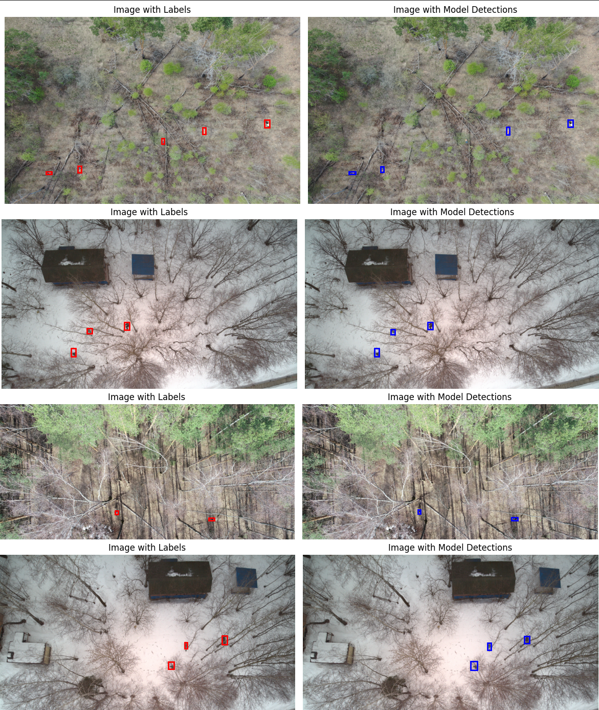
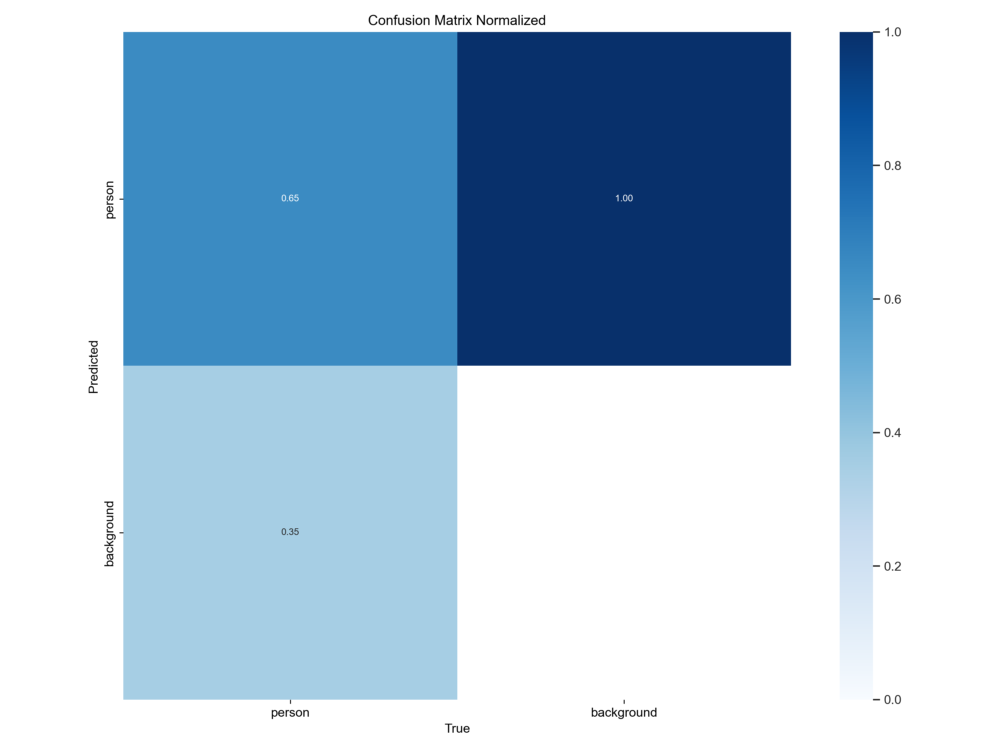
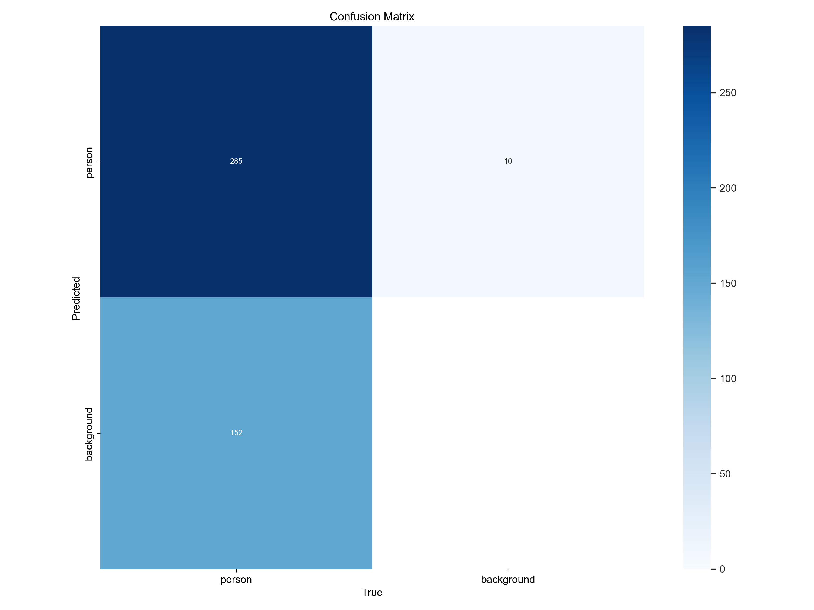
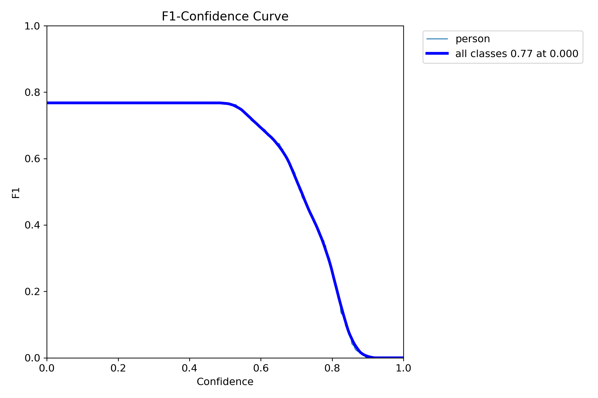
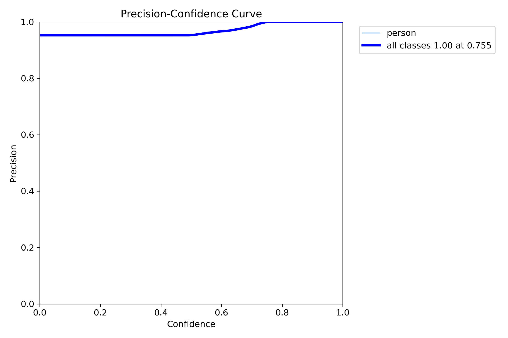
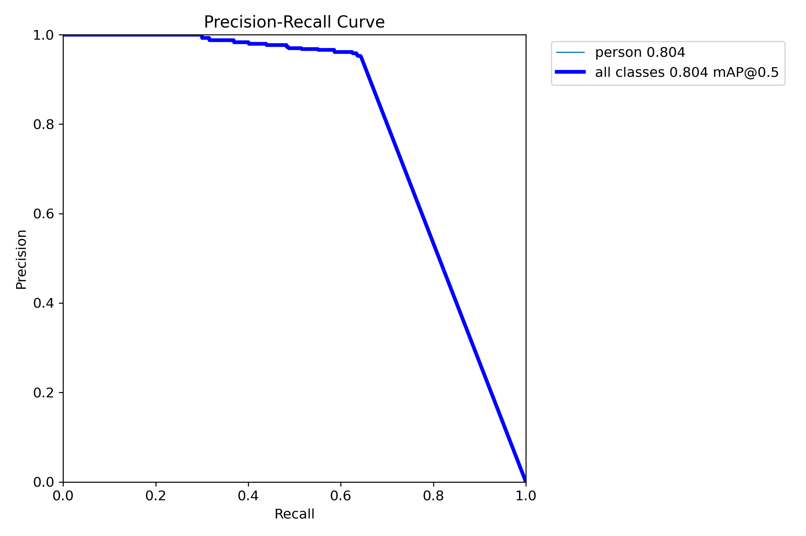
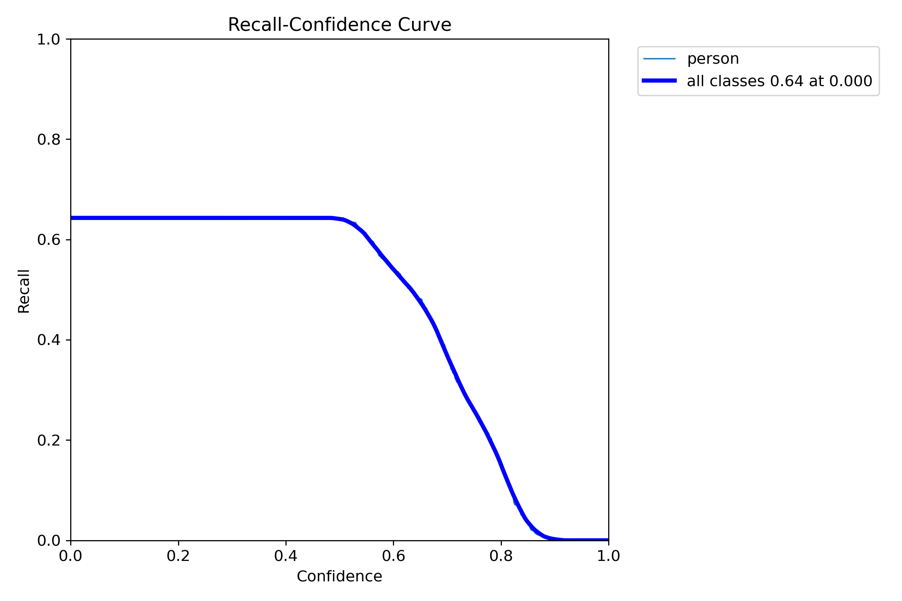
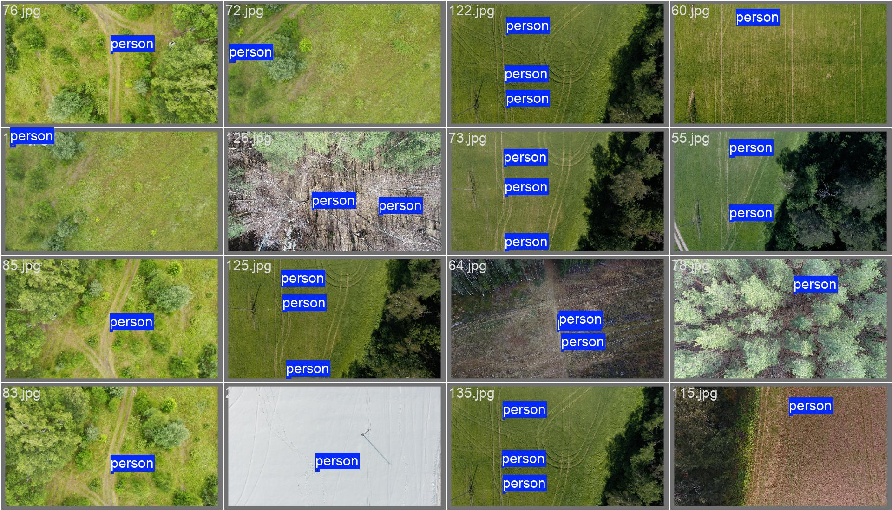
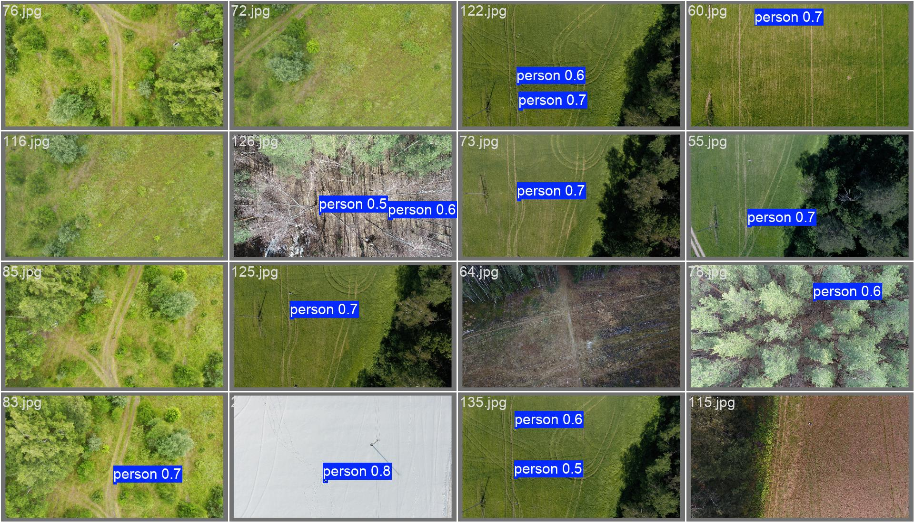

# SearchPersonAI

---

### Описание
> Дипломная работа - Разработка программного обеспечения для детекции людей с беспилотного летательного аппарата на основе технологий машинного зрения.

---

### Цель
> Целью работы заключается разработка программного обеспечения для детекции людей с беспилотного летательного аппарата на основе машинного зрения, для уменьшения человеческих ресурсов в поисково-спасательных операциях, уменьшение количество времени на поиски и минимизировать ошибки человеческого характера.

---

### Полезные ссылки
 - Данные взят за основу [dataLADD](https://www.kaggle.com/datasets/mersico/lacmus-drone-dataset-ladd-v40)
 - Доска трелло [ссылка](https://trello.com/b/URGVZf3f/%D0%B4%D0%B8%D0%BF%D0%BB%D0%BE%D0%BC)

---

### Текущие резульаты
 - 06.12.2024
 > 
 > 
 > 
 > 
 > 
 > 
 > 
 > 
 > 


<!--  -->

<!-- > Это цитата. -->

<!-- ```javascript
console.log('Hello, world!'); -->

<!-- ### Таблицы
Таблицы создаются с помощью вертикальных черт `|` и дефисов `-`:

```markdown
| Заголовок 1 | Заголовок 2 |
|-------------|-------------|
| Ячейка 1    | Ячейка 2    |
| Ячейка 3    | Ячейка 4    | -->
