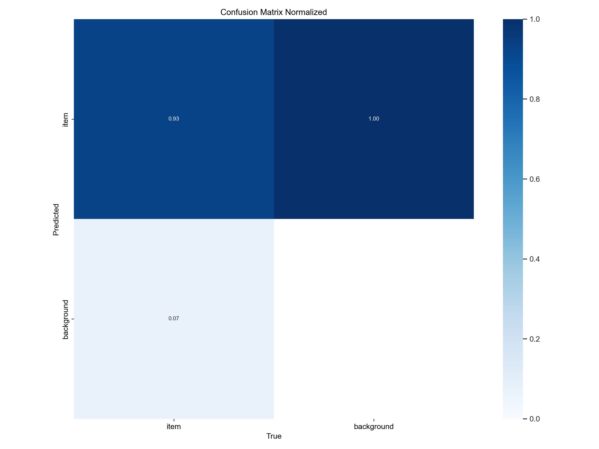
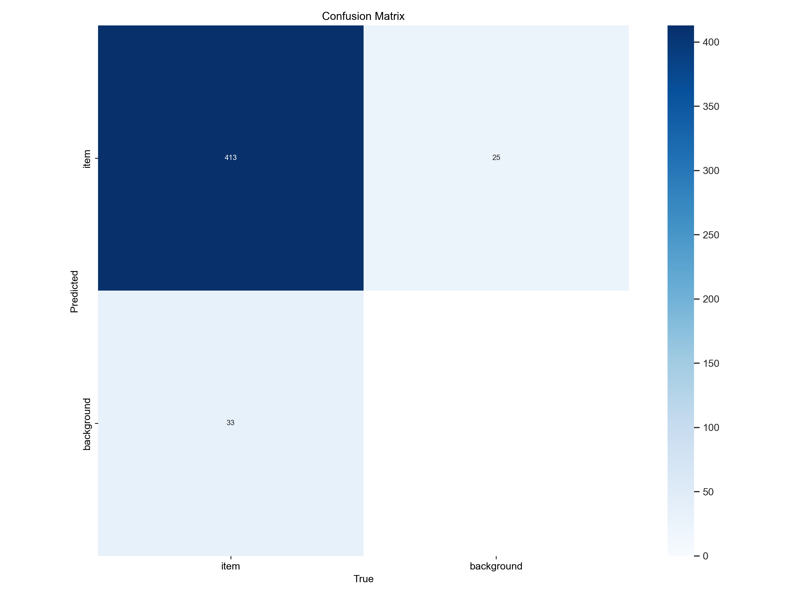
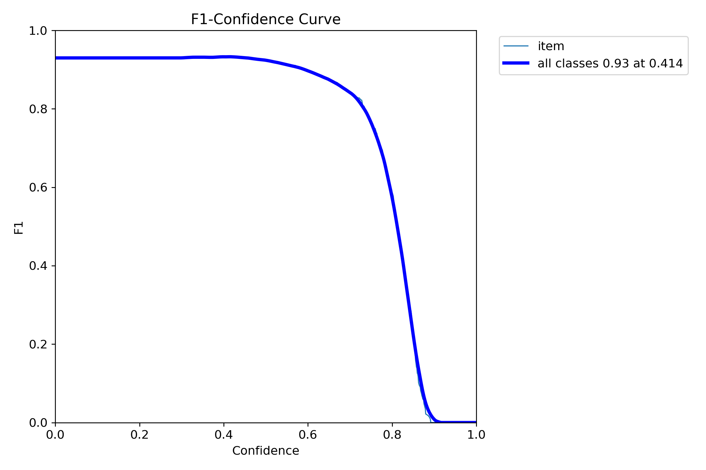
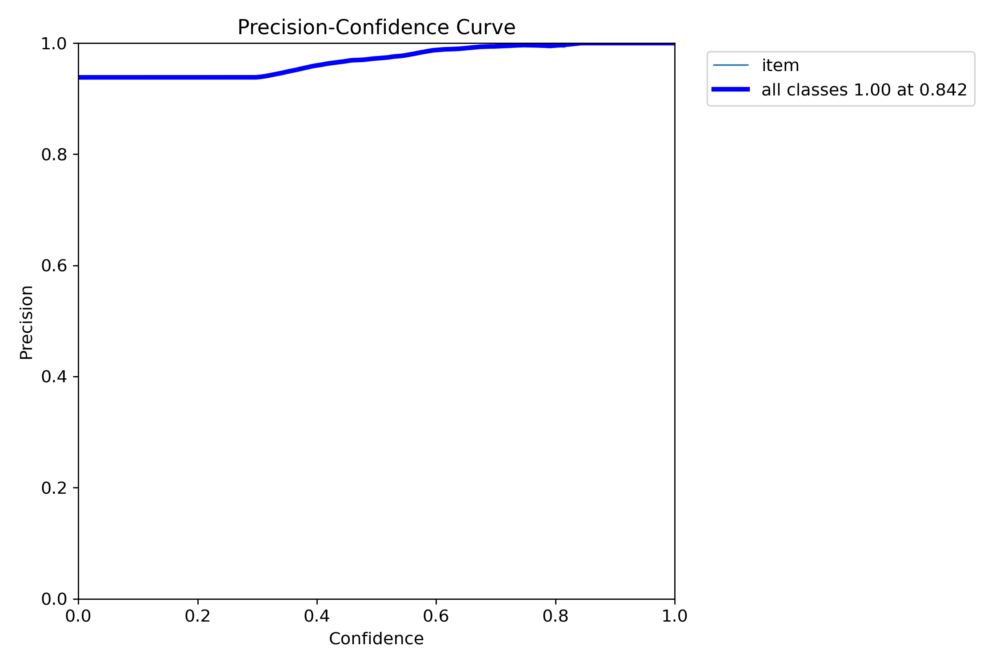
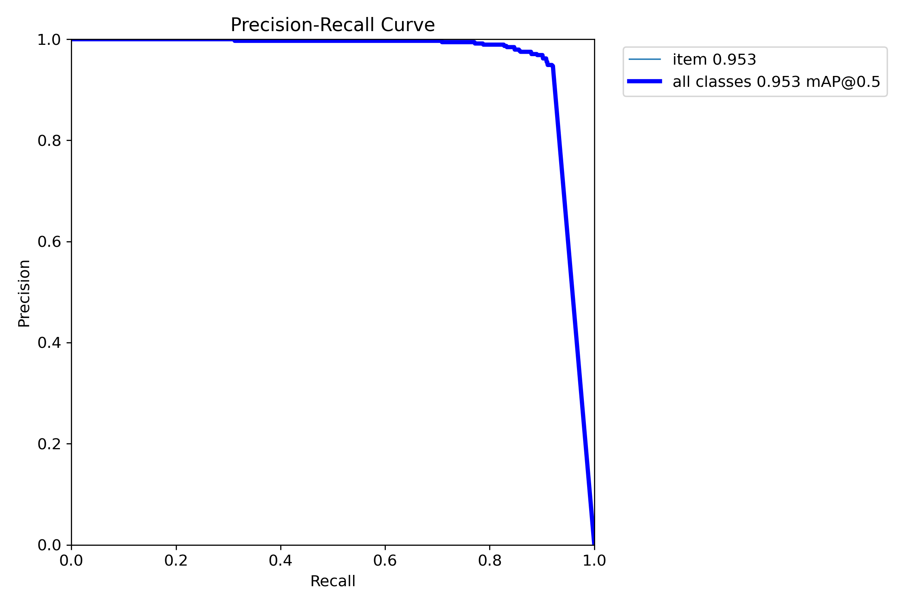
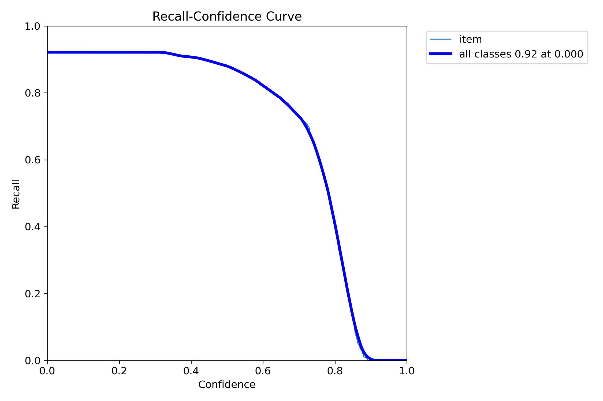
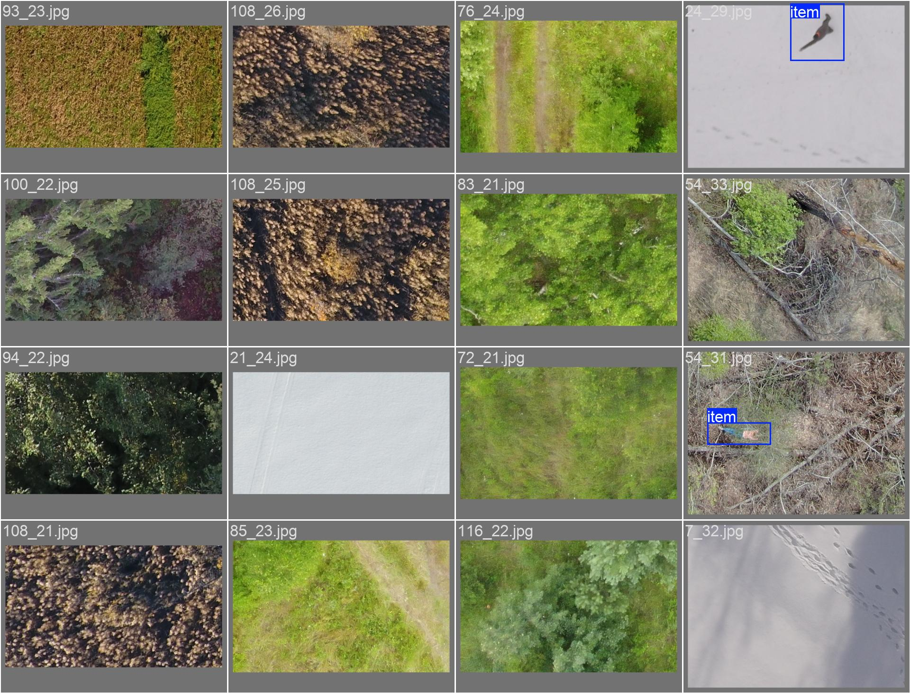

# SearchPersonAI

---

### Описание
> Дипломная работа - Разработка программного обеспечения для детекции людей с беспилотного летательного аппарата на основе технологий машинного зрения.

---

### Цель
> Целью работы заключается разработка программного обеспечения для детекции людей с беспилотного летательного аппарата на основе машинного зрения, для уменьшения человеческих ресурсов в поисково-спасательных операциях, уменьшение количество времени на поиски и минимизировать ошибки человеческого характера.

---

### Полезные ссылки
 - Данные взят за основу [dataLADD](https://www.kaggle.com/datasets/mersico/lacmus-drone-dataset-ladd-v40)
 - Доска трелло [ссылка](https://trello.com/b/URGVZf3f/%D0%B4%D0%B8%D0%BF%D0%BB%D0%BE%D0%BC)

---

### Текущие резульаты
 - 27.03.2025
 > 
 > 
 > 
 > 
 > 
 > 
 > 
 > 
 > 


### Таблица

| № | Модель                    | Precision | Recall | mAP@0.5 | mAP@0.5:0.95 | Fitness | F1     | Комментарий                           |
|---|---------------------------|-----------|--------|---------|--------------|---------|--------|----------------------------------------|
| 1 | yolov8n 100               | 0.9525    | 0.6430 | 0.8043  | 0.5005       | 0.5309  | 0.7678 | -                                      |
| 2 | yolov8n 100 split         | 0.9525    | 0.6430 | 0.8043  | 0.5005       | 0.5309  | 0.7678 | Разбил картинки на части               |
| 3 | yolov8s 100 split aug 1  | 0.9314    | 0.7409 | 0.8442  | 0.6304       | 0.6518  | 0.8253 | Тестирование 11                        |
| 4 | yolov8s_200_split_aug    | 0.9424    | 0.8273 | 0.9118  | 0.6998       | 0.7210  | 0.8811 | -                                      |
| 5 | yolo11s_210_split_aug    | 0.8981    | 0.8614 | 0.9098  | 0.6907       | 0.7126  | 0.8794 | Аугментация: кол-во копий              |
| 6 | yolo8s_400_split_aug     | 0.9211    | 0.8409 | 0.9082  | 0.6915       | 0.7132  | 0.8792 | Аугментация: кол-во копий              |
| 7 | yolo8s_300_split_aug_scale | 0.9537  | 0.9103 | 0.9535  | 0.7310       | 0.7533  | 0.9315 | Увеличение рамок в 1.5 раза            |


<!--  -->

<!-- > Это цитата. -->

<!-- ```javascript
console.log('Hello, world!'); -->

<!-- ### Таблицы
Таблицы создаются с помощью вертикальных черт `|` и дефисов `-`:

```markdown
| Заголовок 1 | Заголовок 2 |
|-------------|-------------|
| Ячейка 1    | Ячейка 2    |
| Ячейка 3    | Ячейка 4    | -->
